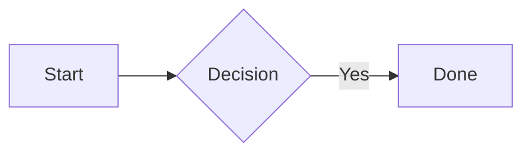

<p align="center">
  
</p>

<h1 align="center">InkDown</h1>

<p align="center">
  <strong>Markdown in. Beautiful documents out.</strong><br>
  <sub>PDF &bull; DOCX &bull; HTML &bull; EPUB &bull; Slides &bull; Mermaid Diagrams &bull; LaTeX Math &bull; REST API &bull; PWA &bull; Syntax Highlighting &bull; Smart Tables</sub>
</p>

<p align="center">
  <a href="#-quick-start"></a>&nbsp;
  
  
  
</p>

---

## ✨ What is InkDown?

InkDown turns raw Markdown into **pixel-perfect PDFs**, **native Word documents**, **self-contained HTML**, **EPUB e-books**, and **Reveal.js presentations** — with zero config. Use the web UI, the CLI, or call the **REST API** from any app in any language.

> *Think of it as a print button for your `.md` files — or a document microservice for your platform.*

```
  ┌─────────────┐      ┌──────────────┐      ┌──────────────────────────────┐
  │  Markdown   │ ───▶ │   InkDown    │ ───▶ │  PDF · DOCX · HTML           │
  │  Web · CLI  │      │  REST API    │      │  EPUB · Slides (Reveal.js)   │
  │  REST API   │      │  ⚡ Engine    │      │  pixel-perfect, ready to share│
  └─────────────┘      └──────────────┘      └──────────────────────────────┘
```

---

## 🎯 Features at a Glance

| | Feature | Details |
|---|---------|---------|
| 📄 | **PDF Output** | Headless Chrome rendering via Puppeteer, A4/Letter/Legal/A3/A5, portrait & landscape |
| 📝 | **DOCX Output** | Native Word documents via Pandoc — real styles, embedded Mermaid images, custom reference templates |
| 🌐 | **HTML Export** | Standalone, self-contained HTML — images base64-inlined, Mermaid SVGs embedded |
| 📚 | **EPUB Export** | E-book format via Pandoc — compatible with Kindle, iBooks, and any EPUB reader |
| 🎞️ | **Slides / Presentations** | Reveal.js HTML presentations — 11 themes, 6 transitions, vertical slides, auto-split by heading |
| 💧 | **Watermarks** | Diagonal watermark text on every page (e.g. `DRAFT`, `CONFIDENTIAL`) |
| 🔀 | **Document Merging** | Combine multiple Markdown files into one output via `POST /api/v1/merge` |
| 📋 | **YAML Frontmatter** | `title`, `author`, `date`, `toc`, `pageSize`, `landscape`, `theme`, `watermark` — read from the file itself |
| 🔤 | **Variable Substitution** | `{{title}}`, `{{author}}`, `{{date}}` placeholders replaced from frontmatter |
| 🎨 | **Custom CSS Themes** | Point at any `.css` file — override the default print stylesheet entirely |
| 📈 | **Mermaid Diagrams** | Flowcharts, sequence, Gantt, pie, ER, state, class, git graph, mindmaps — rendered as high-DPI SVG/PNG |
| ➗ | **LaTeX Math** | Inline `$E=mc^2$` and block `$$...$$` equations via KaTeX |
| 🖌️ | **Syntax Highlighting** | 190+ languages, GitHub-light theme via highlight.js |
| 📊 | **Smart Tables** | Pipe, grid, multiline tables — auto-scale, word-wrap, alternating rows |
| 🖼️ | **Image Handling** | Local images base64-inlined, remote images auto-constrained |
| 📄 | **Page Break Control** | Manual `<!-- pagebreak -->` comments or auto-break before H1 |
| 📑 | **Table of Contents** | Auto-generated, clickable TOC in all output formats |
| 🔢 | **Page Numbers** | Footer on every page: *Title — Page X / Y* |
| 🧠 | **Smart Analyzer** | AST-based pre-processing — fixes heading hierarchy, detects ASCII art |
| 🔍 | **Asset Validation** | Checks broken image paths and file links before conversion — warnings in response headers |
| ⚡ | **Async Job Queue** | Enqueue long conversions, poll for status, download result when ready |
| 🔔 | **Webhook Callbacks** | `callbackUrl` on async jobs — get POSTed when the conversion finishes |
| 📊 | **Prometheus Metrics** | `/api/v1/metrics` — uptime, conversion counts per format, job queue stats |
| 🔑 | **API Key Auth** | Bearer token or `X-API-Key` header, multiple keys supported |
| 🚦 | **Rate Limiting** | 60 conversions per 15 min by default — configurable via `INKDOWN_RATE_LIMIT` |
| 📱 | **PWA** | Installable on any device, works offline, add to home screen |
| 🌗 | **Dark & Light Theme** | Toggle in the web UI, preference persists across sessions |
| 🔌 | **REST API** | Call from any language — JSON body, file upload, or URL fetch |

---

## 🚀 Quick Start

> **Prerequisites:** [Node.js](https://nodejs.org/) 18+ and [Pandoc](https://pandoc.org/installing.html) (for DOCX/EPUB export)

```bash
# Clone & install
git clone <repo-url> && cd inkdown
npm install

# Install Pandoc (required for DOCX and EPUB export)
brew install pandoc          # macOS
sudo apt install pandoc      # Linux/Debian
choco install pandoc         # Windows

# Launch
node server.js
```

Then open **[http://localhost:3000](http://localhost:3000)** — that's it.

---

## 🐳 Docker

InkDown is published to **Docker Hub** as [`aryansin1234/inkdown`](https://hub.docker.com/r/aryansin1234/inkdown).  
The image bundles Node 20, Chromium, and Pandoc — no local installs needed.

### Available Tags

| Tag | Description |
|-----|-------------|
| `latest` | Most recent stable build |
| `v1.0.0` | First stable release |

### Option 1 — One-liner (fastest)

```bash
docker run -p 3000:3000 aryansin1234/inkdown:latest
```

Open **[http://localhost:3000](http://localhost:3000)** and you're done.

### Option 2 — Docker Compose (recommended for servers)

```bash
docker compose up -d
docker compose down
```

### Option 3 — With API Key (production)

```bash
docker run -p 3000:3000 \
  -e INKDOWN_API_KEYS=your-secret-key \
  aryansin1234/inkdown:latest
```

Pass the key in requests:
```
X-API-Key: your-secret-key
# or
Authorization: Bearer your-secret-key
```

### Environment Variables

| Variable | Default | Description |
|----------|---------|-------------|
| `PORT` | `3000` | Port the server listens on |
| `INKDOWN_API_KEYS` | *(none — open)* | Comma-separated API keys. When set, `/api/v1/convert` requires a valid key. |
| `INKDOWN_CORS_ORIGINS` | `*` | Allowed CORS origins. Restrict in production: `https://myapp.com` |
| `INKDOWN_RATE_LIMIT` | `60` | Max conversion requests per 15-minute window per IP |
| `INKDOWN_JOB_TTL_MIN` | `30` | Minutes to keep async job results before cleanup |
| `INKDOWN_MAX_CONCURRENT` | `3` | Max concurrent async conversions |

---

## 📋 YAML Frontmatter

Add a YAML block at the top of any `.md` file to control output without touching API params:

```yaml
---
title: "API Reference"
author: "Aryan Singh"
date: "June 2026"
toc: true
pageSize: Letter       # A4 | Letter | A3 | A5 | Legal
landscape: false
watermark: "DRAFT"     # diagonal text overlay on every page
theme: "./my-theme.css" # custom CSS for PDF/HTML output
referenceDoc: "./brand.docx" # custom .docx styles template
---

# Introduction

Welcome to {{title}}, written by {{author}}.
```

`{{variable}}` placeholders in the document body are replaced with frontmatter values at conversion time.

---

## 🖥️ Web App

### Three ways to feed it Markdown

| Mode | How |
|------|-----|
| **✏️ Editor** | Type or paste Markdown — live preview as you type |
| **📁 Upload** | Drag & drop a `.md` file, or click to browse |
| **🔗 URL** | Paste any public `.md` link (GitHub raw URLs work great) |

### Options panel

| Option | What it does |
|--------|-------------|
| 📑 Table of Contents | Auto-generated TOC linked to your headings |
| 📄 Auto Page Breaks | Insert a break before every H1 |
| ✏️ Document Title | Override the footer title |

### ⌨️ Keyboard Shortcuts

| Shortcut | Action |
|----------|--------|
| `⌘ Enter` / `Ctrl Enter` | Generate document |
| `Tab` in editor | Insert 2-space indent |

---

## 💻 CLI

Convert files straight from the terminal — no server required.

```bash
node src/cli.js [options] <input.md> [output]
```

### Flags

| Flag | Description |
|------|-------------|
| `--toc` | Prepend a Table of Contents |
| `--auto-break` | Page break before every H1 |
| `--format <fmt>` | Output format: `pdf` (default), `docx`, `html`, `epub`, `slides` |
| `--title <text>` | Custom document title |
| `--author <name>` | Author name on cover page |
| `--page-size <size>` | `A4` (default), `A3`, `A5`, `Letter`, `Legal` |
| `--landscape` | Landscape orientation |
| `--watermark <text>` | Diagonal watermark on every page (e.g. `DRAFT`) |
| `--theme <path>` | Path to custom CSS file (PDF and HTML only) |
| `--reference-doc <path>` | Path to custom `.docx` reference template |
| `-h`, `--help` | Show help |

### Examples

```bash
# PDF (default)
node src/cli.js README.md

# DOCX with TOC and auto page breaks
node src/cli.js --format docx --toc --auto-break docs/guide.md output/guide.docx

# Self-contained HTML
node src/cli.js --format html README.md output/README.html

# EPUB e-book
node src/cli.js --format epub --toc README.md output/README.epub

# Reveal.js slides presentation
node src/cli.js --format slides README.md output/slides.html

# Letter-size PDF with watermark
node src/cli.js --page-size Letter --watermark DRAFT report.md report.pdf

# Custom CSS theme + author
node src/cli.js --theme ./brand.css --author "Jane" --title "Guide" docs.md out.pdf
```

---

## 🔌 REST API

InkDown exposes a versioned REST API for integrating document conversion into any platform or pipeline.

### Base URL

```
http://localhost:3000/api/v1
```

### Authentication

Authentication is **optional by default**. Set `INKDOWN_API_KEYS` to require a key:

```bash
INKDOWN_API_KEYS=your_secret_key node server.js
```

Pass in either header:
```
X-API-Key: your_secret_key
Authorization: Bearer your_secret_key
```

### Endpoints

| Method | Path | Auth | Description |
|--------|------|------|-------------|
| `GET` | `/api/v1/health` | No | Server status and version |
| `GET` | `/api/v1/info` | No | API metadata and endpoint list |
| `POST` | `/api/v1/convert` | If configured | Convert Markdown → PDF, DOCX, HTML, EPUB, or Slides |
| `POST` | `/api/v1/merge` | If configured | Merge multiple Markdown documents into one output |
| `POST` | `/api/v1/jobs` | If configured | Enqueue an async conversion job |
| `GET` | `/api/v1/jobs/:id` | If configured | Poll async job status; add `?download=1` to fetch file |
| `GET` | `/api/v1/metrics` | If configured | Prometheus-compatible metrics |

---

### POST /api/v1/convert

**Input — pick one:**

| Field | Type | Description |
|-------|------|-------------|
| `markdown` | String | Raw Markdown content |
| `url` | String | Public `https://` URL to a `.md` file |
| `file` | File | Multipart `.md` file upload |

**Options:**

| Field | Type | Default | Description |
|-------|------|---------|-------------|
| `format` | `pdf` \| `docx` \| `html` \| `epub` \| `slides` | `pdf` | Output format |
| `title` | String | filename | Document title |
| `author` | String | — | Author name on cover page |
| `toc` | Boolean | `false` | Generate Table of Contents |
| `autoBreak` | Boolean | `false` | Page break before every H1 |
| `pageSize` | `A4` \| `Letter` \| `A3` \| `A5` \| `Legal` | `A4` | Page size (PDF) |
| `landscape` | Boolean | `false` | Landscape orientation |
| `watermark` | String | — | Diagonal watermark text on every page |
| `numberSections` | Boolean | `false` | Numbered headings (DOCX only) |

**Response headers:**  
On success, binary file with `Content-Disposition: attachment; filename="..."`.  
If asset warnings exist, `X-InkDown-Warnings` header contains a JSON array of `{ type, message, ref, line }` objects.

---

### POST /api/v1/merge

Combine multiple Markdown documents into a single output.

```json
{
  "documents": ["# Doc 1\n...", "# Doc 2\n..."],
  "format": "pdf",
  "separator": "pagebreak",
  "title": "Combined Report",
  "toc": true
}
```

| Field | Type | Default | Description |
|-------|------|---------|-------------|
| `documents` | String[] | *required* | Ordered array of Markdown strings (max 50) |
| `format` | String | `pdf` | Output format |
| `separator` | `pagebreak` \| `hr` \| `none` | `pagebreak` | How to join documents |
| `title`, `author`, `toc`, `watermark`, `pageSize` | — | — | Same as `/convert` |

---

### POST /api/v1/jobs (Async)

Enqueue a conversion and get a job ID immediately — no waiting for large files.

```bash
# Enqueue
curl -X POST http://localhost:3000/api/v1/jobs \
  -H "Content-Type: application/json" \
  -d '{"markdown": "# Big Doc...", "format": "pdf", "callbackUrl": "https://yourapp.com/webhook"}'
# → {"jobId": "abc-123", "status": "queued", "pollUrl": "/api/v1/jobs/abc-123"}

# Poll
curl http://localhost:3000/api/v1/jobs/abc-123
# → {"status": "done", "downloadUrl": "/api/v1/jobs/abc-123?download=1"}

# Download
curl "http://localhost:3000/api/v1/jobs/abc-123?download=1" --output result.pdf
```

When `callbackUrl` is set, InkDown POSTs a JSON payload to that URL when the job finishes.

---

### GET /api/v1/metrics

Prometheus-compatible plain-text metrics:

```
inkdown_uptime_seconds 3600
inkdown_conversions_total{format="pdf"}  42
inkdown_conversions_total{format="docx"} 8
inkdown_jobs_total{status="done"}        15
inkdown_jobs_total{status="failed"}      1
```

---

### Code Examples

**cURL — PDF**
```bash
curl -X POST http://localhost:3000/api/v1/convert \
  -H "Content-Type: application/json" \
  -H "X-API-Key: your_secret_key" \
  -d '{"markdown": "# Hello\n\nWorld!", "format": "pdf", "toc": true}' \
  --output document.pdf
```

**cURL — Reveal.js Slides**
```bash
curl -X POST http://localhost:3000/api/v1/convert \
  -H "Content-Type: application/json" \
  -d '{"markdown": "# Slide 1\n\n---\n\n# Slide 2", "format": "slides"}' \
  --output presentation.html
```

**JavaScript**
```javascript
const res = await fetch('http://localhost:3000/api/v1/convert', {
  method: 'POST',
  headers: { 'Content-Type': 'application/json', 'X-API-Key': 'your_secret_key' },
  body: JSON.stringify({ markdown: '# Hello\n\nWorld!', format: 'pdf', pageSize: 'Letter' }),
});
const blob = await res.blob();
```

**Python**
```python
import requests
r = requests.post(
    'http://localhost:3000/api/v1/convert',
    headers={'X-API-Key': 'your_secret_key'},
    json={'markdown': '# Hello\n\nWorld!', 'format': 'epub', 'toc': True},
)
open('document.epub', 'wb').write(r.content)
```

> Full parameter reference is in [API.md](API.md).

---

## 🎞️ Slides (Reveal.js)

InkDown can turn any Markdown file into a full **Reveal.js HTML presentation** — no setup, no build step.

### Slide separators

| Separator | Effect |
|-----------|--------|
| `---` on its own line | New horizontal slide |
| `----` on its own line | New vertical slide (nested) |
| *(no separators)* | Auto-split at every H1 / H2 |

### Frontmatter options

```yaml
---
title: "My Presentation"
theme: black        # black|white|league|beige|sky|night|serif|simple|solarized|moon|dracula
transition: slide   # none|fade|slide|convex|concave|zoom
controls: true
progress: true
---

# Slide 1

Content here.

---

# Slide 2

More content.

----

## Vertical sub-slide
```

### CLI

```bash
node src/cli.js --format slides my-talk.md output/talk.html
```

---

## ⚙️ Configuration

| Variable | Default | Description |
|----------|---------|-------------|
| `PORT` | `3000` | Port the server listens on |
| `INKDOWN_API_KEYS` | *(none)* | Comma-separated API keys. If unset, API is open. |
| `INKDOWN_CORS_ORIGINS` | `*` | Comma-separated allowed CORS origins |
| `INKDOWN_RATE_LIMIT` | `60` | Max conversions per 15 min per IP |
| `INKDOWN_JOB_TTL_MIN` | `30` | Minutes to retain async job result files |
| `INKDOWN_MAX_CONCURRENT` | `3` | Parallel async conversions |
| `INKDOWN_MAX_JOBS` | `500` | Max tracked jobs before queue rejects new ones |

Generate a strong API key:
```bash
openssl rand -hex 32
```

---

## 📝 Supported Markdown

InkDown supports the full **GitHub Flavored Markdown** spec, plus extras:

<details>
<summary><strong>Click to expand syntax reference</strong></summary>

````markdown
# Heading 1
## Heading 2
### Heading 3

**Bold**, *italic*, ~~strikethrough~~, `inline code`

[Links](https://example.com) and 

> Blockquotes with styled left-border

- Unordered lists
  - Nested items
1. Ordered lists

```javascript
// Fenced code blocks with syntax highlighting
const greet = name => `Hello, ${name}!`;
```

| Column A | Column B |
|----------|----------|
| Cell 1   | Cell 2   |

$E = mc^2$          <!-- inline math -->

$$
\int_0^\infty e^{-x^2} dx = \frac{\sqrt{\pi}}{2}
$$

<!-- pagebreak -->

---


````

</details>

---

## 🏗️ Project Structure

```
├── server.js                Express server — web UI + REST API v1
├── src/
│   ├── analyzer.js          Smart Markdown Analyzer (remark AST plugins)
│   ├── converter.js         PDF + HTML engine — Puppeteer + marked
│   ├── docxConverter.js     DOCX engine — Pandoc + Smart Analyzer
│   ├── epubConverter.js     EPUB engine — Pandoc
│   ├── slidesConverter.js   Reveal.js HTML presentation engine
│   ├── frontmatter.js       YAML frontmatter parsing + {{variable}} substitution
│   ├── validator.js         Pre-conversion link & asset validator
│   ├── jobQueue.js          In-memory async job queue with webhook support
│   ├── cli.js               CLI entry point (all formats)
│   └── styles.css           Default print stylesheet for PDF rendering
├── public/
│   ├── index.html           Web app (converter UI)
│   ├── app.css              UI design system (dark/light themes)
│   └── app.js               Frontend logic & animations
├── vscode-extension/        VS Code extension source
│   ├── src/
│   │   ├── extension.ts     Extension entry point
│   │   ├── commands.ts      All commands (convert, batch, auto-export)
│   │   ├── wordCount.ts     Live word count + reading time status bar
│   │   ├── symbolProvider.ts Markdown heading → Outline panel symbols
│   │   ├── previewPanel.ts  Live preview webview
│   │   ├── inkdownClient.ts API + CLI client
│   │   ├── serverManager.ts Local server lifecycle management
│   │   └── statusBar.ts     Server status bar item
│   └── snippets/
│       └── inkdown.code-snippets  Mermaid + KaTeX + frontmatter snippets
├── samples/
│   └── master-test.md       Sample covering all features
├── reference.docx           Optional Pandoc reference template
├── API.md                   Full REST API reference
├── ARCHITECTURE.md          Technical deep-dive & system design
└── ROADMAP.md               Feature roadmap and implementation plan
```

---

## 🧩 VS Code Extension

The **InkDown VS Code Extension** brings the full InkDown engine directly into your editor — no browser, no terminal, no context switching. Open any `.md` file and export it to PDF, DOCX, HTML, EPUB, or Reveal.js slides with a single keyboard shortcut.

The extension connects to a local InkDown server (it can start and manage one for you automatically) or falls back to the InkDown CLI. This means you get the same high-fidelity output — Mermaid diagrams, KaTeX math, syntax highlighting, custom CSS themes — without leaving VS Code.

**Key highlights:**
- **One-click export** — `⌘⇧⌥P` converts the active file to PDF instantly
- **Live preview** — side-by-side rendered Markdown that updates as you type
- **Auto-export on save** — toggle it on and every save triggers a fresh export
- **Batch export** — right-click any folder in the Explorer to export all `.md` files at once
- **Convert with Options wizard** — step-by-step UI for picking format, page size, TOC, watermark, and custom templates
- **Word count + reading time** — always visible in the VS Code status bar
- **Outline panel** — H1–H6 headings appear as navigable symbols
- **Built-in snippets** — type `flow`, `seq`, `gantt`, `katex`, `frontmatter` etc. to scaffold common blocks

**Install:** Search for `InkDown` in the VS Code Extensions panel (`⌘⇧X`) or install it from the [VS Code Marketplace](https://marketplace.visualstudio.com/items?itemName=inkdown.inkdown-vscode).

**Prerequisite:** An InkDown server running at `http://localhost:3000` (default), or the InkDown CLI available on your `PATH`. Configure the server URL and API key via the `inkdown.serverUrl` and `inkdown.apiKey` settings.

### Commands

| Command | Shortcut (Mac) | Description |
|---------|---------------|-------------|
| InkDown: Convert to PDF | `⌘⇧⌥P` | Export active file as PDF |
| InkDown: Convert to DOCX | `⌘⇧⌥D` | Export active file as Word document |
| InkDown: Export as Slides | `⌘⇧⌥S` | Export as Reveal.js HTML presentation |
| InkDown: Open Preview | `⌘⇧⌥V` | Live Markdown preview panel |
| InkDown: Convert with Options… | — | Step-by-step wizard (format, page size, template, TOC…) |
| InkDown: Export all Markdown files in folder | — | Batch export via Explorer right-click |
| InkDown: Toggle Auto-Export on Save | — | Enable/disable auto-export when you save |

### Extension Settings

| Setting | Default | Description |
|---------|---------|-------------|
| `inkdown.serverUrl` | `http://localhost:3000` | InkDown server URL |
| `inkdown.apiKey` | — | API key for the server |
| `inkdown.outputDirectory` | *(same folder as source)* | Where to save exported files |
| `inkdown.defaultFormat` | `pdf` | Default export format |
| `inkdown.autoExport` | `false` | Auto-export on save |
| `inkdown.autoExportFormat` | `pdf` | Format for auto-export |
| `inkdown.defaultToc` | `false` | Include TOC by default |
| `inkdown.defaultAutoBreak` | `false` | Auto page breaks by default |
| `inkdown.openAfterConvert` | `true` | Open file after conversion |

### Per-workspace `.inkdown.json`

Drop a `.inkdown.json` file in your workspace root to set project-level defaults:

```json
{
  "format": "pdf",
  "toc": true,
  "pageSize": "Letter",
  "outputDirectory": "./dist/docs",
  "referenceDoc": "./brand.docx"
}
```

### Built-in Snippets

Type a prefix in any `.md` file to insert a skeleton:

| Prefix | Inserts |
|--------|---------|
| `mermaid-flowchart` / `flow` | Mermaid flowchart |
| `mermaid-sequence` / `seq` | Sequence diagram |
| `mermaid-er` / `erd` | ER diagram |
| `mermaid-gantt` / `gantt` | Gantt chart |
| `mermaid-state` / `state` | State diagram |
| `mermaid-class` / `class` | Class diagram |
| `mermaid-pie` / `pie` | Pie chart |
| `mermaid-mindmap` / `mindmap` | Mindmap |
| `math-inline` / `katex` | Inline `$...$` math |
| `math-block` / `katex-block` | Block `$$...$$` equation |
| `frontmatter` / `inkdown-fm` | Full YAML frontmatter block |
| `pagebreak` / `pb` | `<!-- pagebreak -->` |

### Live Features

- **Word count + reading time** — shown in the status bar whenever a Markdown file is open
- **Outline panel** — headings (H1–H6) appear in the VS Code Outline panel with proper nesting
- **Live preview** — side-by-side preview that updates as you type

---

## 📦 Tech Stack

| Package | Role |
|---------|------|
| **Puppeteer** | Headless Chrome → PDF and HTML rendering |
| **Pandoc** | Markdown → native Word DOCX and EPUB (system binary) |
| **Mermaid** | 10+ diagram types → high-DPI SVG (bundled, no CDN) |
| **KaTeX** | LaTeX math rendering (inline & block) |
| **marked** | Markdown → HTML (GFM spec) |
| **highlight.js** | Syntax highlighting (190+ languages) |
| **gray-matter** | YAML frontmatter parsing |
| **unified / remark** | Markdown AST parsing & smart analysis plugins |
| **express-rate-limit** | Per-IP rate limiting |
| **Express** | HTTP server |
| **cors** | CORS headers with configurable origin allowlist |
| **multer** | Multipart file upload handling |

---

## 🛠️ Scripts

```bash
npm start           # Start the server (port 3000)
npm run dev         # Alias for npm start
npm test            # Convert samples/master-test.md → output/test.pdf
npm run test:docx   # Convert samples/master-test.md → output/test.docx
npm run convert     # Alias for node src/cli.js
```

---

## 🔒 Security & Privacy

**Privacy:** InkDown runs **100% locally**. Your documents never leave your machine — no cloud, no telemetry, no tracking.

**API security:**
- `/api/v1/convert` supports API key authentication via `INKDOWN_API_KEYS` (Bearer token or `X-API-Key` header)
- Rate limiting (60 requests / 15 min by default) prevents abuse
- URL fetching only allows public `http`/`https` addresses — private IP ranges, loopback, and cloud metadata endpoints (169.254.x.x) are rejected (SSRF protection)
- Image inlining is restricted to files inside the document's own directory — absolute paths and `../../` traversals are blocked
- Set `INKDOWN_CORS_ORIGINS` to restrict which browser origins can call the API

---

## 🤝 Collaborate

InkDown is open source and actively maintained. Contributions are welcome!

- **🐛 Found a bug?** [Open an issue](https://github.com/Aryansin1234/InkDown/issues)
- **💡 Have an idea?** Start a [discussion](https://github.com/Aryansin1234/InkDown/discussions) or open a feature request
- **🔧 Want to contribute?** Fork the repo, make your changes, and submit a PR
- **📬 Want to collaborate?** Reach out — I'm open to partnerships, integrations, and co-building

<p align="center">
  <sub>Made with ☕ and too many late nights.</sub><br>
  <sub>If InkDown saved you time, consider giving it a ⭐</sub>
</p>

