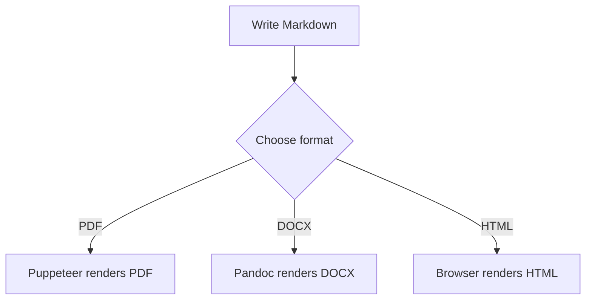

# InkDown — How to Use Every Feature

This guide walks through every InkDown feature with working examples.

---

## 1. Basic Conversion

### Web UI
1. Open **http://localhost:3000** (or start with `node server.js`)
2. Type or paste Markdown in the editor
3. Pick a format — **PDF**, **DOCX**, or **HTML**
4. Click **Convert**

### VS Code Extension — Quick shortcuts
Right-click any `.md` file → choose a format, or use keyboard shortcuts:

| Action | Mac | Windows / Linux |
|--------|-----|-----------------|
| Convert to PDF | `⌘⇧⌥P` | `Ctrl+Shift+Alt+P` |
| Convert to DOCX | `⌘⇧⌥D` | `Ctrl+Shift+Alt+D` |
| Export as HTML | `⌘⇧⌥H` | `Ctrl+Shift+Alt+H` |
| Open Preview | `⌘⇧⌥V` | `Ctrl+Shift+Alt+V` |

### VS Code Extension — Convert with Options wizard
Run `InkDown: Convert with Options…` from the Command Palette for the full multi-step wizard:

| Step | What you set |
|------|-------------|
| **Step 1 — Format** | PDF · DOCX · HTML |
| **Step 2a — Title** | Document title (pre-filled from YAML frontmatter if present) |
| **Step 2b — Author** | Author name |
| **Step 2c — Date** | Date string, e.g. `June 2026` |
| **Step 2d — Watermark** | Diagonal watermark text, e.g. `DRAFT` |
| **Step 3a — Format options** | PDF → page size; DOCX → reference template; HTML → CSS theme |
| **Step 3b — CSS theme** | Browse for a `.css` file to override default styles (PDF & DOCX) |
| **Step 4 — Options** | TOC, Auto page breaks, **Write metadata to YAML frontmatter** |

When **Write to YAML frontmatter** is checked, the wizard saves your metadata choices back into the `.md` file so they are pre-filled next time.

### REST API
```bash
curl -X POST http://localhost:3000/api/v1/convert \
  -H "Content-Type: application/json" \
  -d '{"markdown":"# Hello\n\nWorld","format":"pdf"}' \
  --output output.pdf
```

---

## 2. YAML Frontmatter

Add a YAML block at the top of any `.md` file to set options without touching the UI:

```yaml
---
title: "My Report"
author: "Jane Smith"
date: "June 2026"
toc: true
autoBreak: true
pageSize: A4
watermark: DRAFT
---

# Content starts here
```

| Key | Values | Effect |
|-----|--------|--------|
| `title` | Any string | Sets document title & PDF cover |
| `author` | Any string | Appears on cover page |
| `date` | Any string | Appears on cover page |
| `toc` | `true` / `false` | Prepend Table of Contents |
| `autoBreak` | `true` / `false` | Page break before every H1 |
| `pageSize` | `A4` `Letter` `A3` `A5` `Legal` | PDF page size |
| `watermark` | Any string | Diagonal watermark (e.g. `DRAFT`) |

---

## 3. Table of Contents

Enable **TOC** in the footer bar (web UI) or pass `toc: true` in frontmatter.

InkDown generates the TOC automatically from your headings (H1–H4) with anchor links.

---

## 4. Mermaid Diagrams

Wrap diagram code in a ` ```mermaid ` fence. All 10 diagram types are supported:



Supported types: `graph`, `sequenceDiagram`, `classDiagram`, `stateDiagram-v2`,
`erDiagram`, `gantt`, `pie`, `gitGraph`, `mindmap`, `timeline`

> **HTML export**: diagrams render live in the browser via mermaid.js (no Puppeteer needed).
> **PDF / DOCX**: diagrams are pre-rendered to SVG/PNG by Puppeteer before embedding.

---

## 5. Math (KaTeX)

Use `$...$` for inline math and `$$...$$` for display blocks:

Inline: $E = mc^2$

Display block:
$$
\int_{-\infty}^{\infty} e^{-x^2} \, dx = \sqrt{\pi}
$$

---

## 6. Custom CSS Theme

Override the default document styles with your own CSS file.

### How to use

**Web UI**: Click **CSS Theme** → **Upload .css…** in the footer settings bar, select your CSS file, then convert.

**API**:
```bash
curl -X POST http://localhost:3000/api/v1/convert \
  -F "file=@document.md" \
  -F "format=pdf" \
  -F "cssTheme=@my-theme.css" \
  --output styled.pdf
```

**VS Code** (`inkdown.json` workspace config):
```json
{
  "theme": "./styles/my-theme.css"
}
```

### What you can style

A theme CSS file completely replaces the default `styles.css`. Copy `src/styles.css` as a starting point and modify it. Key selectors:

```css
/* Body & typography */
body { font-family: 'Georgia', serif; font-size: 12pt; }

/* Headings */
h1 { color: #1a3a5c; border-bottom: 3px solid #1a3a5c; }
h2 { color: #2e6da4; }

/* Code blocks */
pre { background: #1e1e1e; color: #d4d4d4; border: none; }

/* Tables */
thead { background: #1a3a5c; color: white; }

/* Cover page */
.doc-cover h1 { font-size: 3em; color: #1a3a5c; }
```

> Sample theme files are in `samples/themes/` — see `corporate.css` and `minimal.css`.

---

## 7. DOCX Reference Document (Custom Word Styles)

A **reference.docx** is a Word template that controls the look of DOCX output — fonts, heading styles, page margins, headers/footers, and colour scheme.

### How it works

InkDown passes your reference file to Pandoc via `--reference-doc`. Every heading, paragraph, and table in the output inherits styles from your template.

### Create a reference document

**Option 1 — Generate with the script:**
```bash
node samples/make-reference-docx.js
# Creates: samples/reference.docx
```

**Option 2 — Edit manually:**
1. Convert any document: `node server.js` → export a DOCX
2. Open the result in Word / LibreOffice
3. Modify the built-in styles: `Heading 1`, `Heading 2`, `Body Text`, `Code`
4. Save it (keep as `.docx`, not `.dotx`)

### Use a reference document

**VS Code — Convert with Options wizard:**
`InkDown: Convert with Options…` → DOCX → Step 3 → **Browse for template…** → select your `.docx`

**API:**
```bash
curl -X POST http://localhost:3000/api/v1/convert \
  -F "file=@document.md" \
  -F "format=docx" \
  -F "referenceDoc=@samples/reference.docx" \
  --output styled.docx
```

**Workspace config** (`.inkdown.json`):
```json
{
  "format": "docx",
  "referenceDoc": "./templates/company-style.docx"
}
```

### What styles Pandoc maps

| Markdown element | Word style used |
|-----------------|-----------------|
| `# H1` | `Heading 1` |
| `## H2` | `Heading 2` |
| `### H3` | `Heading 3` |
| Body text | `Body Text` or `Normal` |
| ` ```code``` ` block | `Source Code` |
| `> blockquote` | `Block Text` |
| Table header | `Table Header` |

---

## 8. Watermarks

Add a diagonal watermark to PDF and HTML output.

**Web UI**: Type in the **Watermark** field in the footer bar (e.g. `DRAFT`, `CONFIDENTIAL`)

**Frontmatter**: `watermark: CONFIDENTIAL`

**API**: `"watermark": "DRAFT"` in the JSON body

---

## 9. Auto Page Breaks

Enable **Auto-break** to insert a page break before every H1 heading — useful for multi-chapter documents.

**Web UI**: Toggle **Auto-break** in the footer bar
**Frontmatter**: `autoBreak: true`

---

## 10. Batch Export (VS Code)

Export all Markdown files in a folder at once:

1. Right-click a **folder** in the VS Code Explorer
2. Choose **InkDown: Export all Markdown files in folder**
3. All `.md` files are converted using `inkdown.defaultFormat`

Output goes to `inkdown.outputDirectory` if set, otherwise next to each source file.

> **Tip:** Set a shared `.inkdown.json` in the folder to apply a consistent CSS theme or DOCX reference template across the whole batch.

---

## 11. Auto-Export on Save (VS Code)

Automatically re-convert whenever you save a `.md` file:

1. Command Palette → `InkDown: Toggle Auto-Export on Save`
2. Set your preferred format in Settings → `inkdown.autoExportFormat`

---

## 12. Workspace Config (`.inkdown.json`)

Create a `.inkdown.json` in the root of your project to share settings:

```json
{
  "format": "pdf",
  "toc": true,
  "autoBreak": false,
  "pageSize": "A4",
  "outputDirectory": "./dist",
  "referenceDoc": "./templates/style.docx",
  "theme": "./themes/corporate.css"
}
```

---

## 13. Grid Tables

InkDown supports reStructuredText-style grid tables (great for complex layouts):

```
+----------+----------+----------+
| Header 1 | Header 2 | Header 3 |
+==========+==========+==========+
| Cell 1   | Cell 2   | Cell 3   |
+----------+----------+----------+
| Cell 4   | Cell 5   | Cell 6   |
+----------+----------+----------+
```

---

## 14. Variable Substitution

Reference frontmatter values anywhere in your document with `{{key}}`:

```yaml
---
project: "InkDown"
version: "1.5"
---

# {{project}} v{{version}} Release Notes

Built on {{date}}.
```

---

## 15. REST API Reference

| Method | Endpoint | Description |
|--------|----------|-------------|
| `POST` | `/api/v1/convert` | Convert markdown (JSON or multipart) |
| `POST` | `/api/convert` | Legacy endpoint (same behaviour) |
| `GET` | `/api/v1/metrics` | Server stats (requests, uptime) |
| `POST` | `/api/v1/merge` | Merge multiple markdown files |
| `POST` | `/api/v1/jobs` | Queue async conversion job |
| `GET` | `/api/v1/jobs/:id` | Poll job status |

**Authentication** — set `INKDOWN_API_KEYS=key1,key2` as an environment variable, then pass `X-API-Key: your_key` in the request header.

---

*For more details see README.md and API.md in the project root.*
