# Bid & Prove — A Real-Time Knowledge Auction Game

> "You only keep what you can defend."

A multiplayer, room-based game platform where players bid virtual coins on knowledge items, then must prove they actually know what they paid for. Built for live sessions — classrooms, workshops, team offsites, hackathons, study groups, conferences — with a UI that feels alive, not like a quiz tool wearing a costume.

This version goes deeper than the first draft: a fuller pitch, a sharper market angle, an expanded feature set (power-ups, AI narration, knowledge heatmaps, tournaments), more diagrams, and a more opinionated take on what would actually make this special instead of merely functional.

---

## Table of Contents

1. [The Elevator Pitch](#1-the-elevator-pitch)
2. [Why Now / Why This Wins](#2-why-now--why-this-wins)
3. [Competitive Landscape](#3-competitive-landscape)
4. [Core Game Loop](#4-core-game-loop)
5. [Product Pillars](#5-product-pillars)
6. [Advanced Game Mechanics](#6-advanced-game-mechanics)
7. [System Architecture](#7-system-architecture)
8. [Data Model](#8-data-model)
9. [Game State Machine](#9-game-state-machine)
10. [Real-Time Sequence: One Auction Round](#10-real-time-sequence-one-auction-round)
11. [Real-Time Sequence: Power-Up Usage](#11-real-time-sequence-power-up-usage)
12. [Room Lifecycle](#12-room-lifecycle)
13. [UI/UX Design System](#13-uiux-design-system)
14. [Screen-by-Screen Breakdown](#14-screen-by-screen-breakdown)
15. [The Knowledge Heatmap (Host Superpower)](#15-the-knowledge-heatmap-host-superpower)
16. [AI Layer — Generation, Narration, Adjudication](#16-ai-layer--generation-narration-adjudication)
17. [Rive Animation Strategy](#17-rive-animation-strategy)
18. [Tech Stack](#18-tech-stack)
19. [Real-Time Infrastructure Strategy](#19-real-time-infrastructure-strategy)
20. [Anti-Cheat & Integrity](#20-anti-cheat--integrity)
21. [Accessibility & Inclusivity](#21-accessibility--inclusivity)
22. [Progression, Identity & Cross-Session Meta](#22-progression-identity--cross-session-meta)
23. [Monetization Angle (Optional)](#23-monetization-angle-optional)
24. [Implementation Roadmap](#24-implementation-roadmap)
25. [Anti-Snowball & Balance Mechanics](#25-anti-snowball--balance-mechanics)
26. [Risks & Mitigations](#26-risks--mitigations)
27. [North Star Metrics](#27-north-star-metrics)
28. [My Honest Take](#28-my-honest-take)

---

## 1. The Elevator Pitch

Picture the energy of a live auction house — the tension before the gavel falls — fused with the dopamine hit of a pub quiz, except the currency isn't trivia points, it's **self-trust**. Every player in the room is constantly answering one silent question: *how sure am I, really?* And unlike almost every other game built around knowledge, this one makes that question visible, biddable, and consequential, in front of everyone, in real time.

**Bid & Prove** is not a quiz app with a leaderboard bolted on. It's a live social instrument for turning a room full of people's private uncertainty into shared, dramatic, game-show-grade entertainment — while quietly generating one of the most useful side effects a host could want: a precise, honest map of what the room does and doesn't actually understand.

Three sentences a pitch deck could open with:

- *"Kahoot tests what you know. Bid & Prove tests what you think you know — and makes you pay for the difference."*
- *"Every other live quiz tool rewards speed. We reward calibration."*
- *"It's an auction house where the only currency that matters is honesty."*

---

## 2. Why Now / Why This Wins

- **Live, synchronous, shared-screen experiences are back in demand** — post-pandemic hybrid work and event culture has made "everyone on their phone, one big screen up front" a default format for workshops, all-hands, and classrooms. The infrastructure muscle (WebSockets, edge functions, cheap real-time databases) needed to build this well has matured enough that a small team can ship something that feels AAA without an AAA budget.
- **Generative AI removes the content bottleneck.** The single biggest reason live trivia tools stay shallow is that someone has to hand-write good questions. An LLM that can read a session transcript, slide deck, or document and generate calibrated knowledge items and follow-up questions on the fly turns this from "a game you prep for" into "a game that prepares itself."
- **Rive and modern motion tooling make game-show-grade polish achievable without a motion design team of ten.** State-machine-driven animation means a handful of well-built assets can react to dozens of different game states instead of needing a bespoke clip for every outcome.
- **The format is genuinely novel, not a clone.** Kahoot/Jackbox/Slido all exist; none of them combine sealed-bid economics with knowledge testing. That gap is the whole opportunity.

---

## 3. Competitive Landscape

| Tool | Core Loop | What it's missing that we have |
|---|---|---|
| **Kahoot** | Speed-based MCQ, fastest correct answer wins points | No risk/stake mechanic — speed beats understanding; no self-assessment signal |
| **Jackbox Games** | Party games, mostly humor/creativity-based | Not knowledge-oriented at all; no retention/learning use case |
| **Slido / Mentimeter** | Live polling, Q&A, word clouds | Not a *game* — no scoring, no stakes, no replay value |
| **Quizlet Live** | Team-based matching/speed quiz | No economy, no individual risk-taking, team-only |
| **Bid & Prove** | Sealed-bid auction on knowledge confidence, pay-to-prove follow-up | **The only one where the score reflects calibrated confidence, not just correctness or speed** |

The honest gap in the market: nothing currently makes *overconfidence visible and costly* in a fun way. That's the wedge.

---

## 4. Core Game Loop

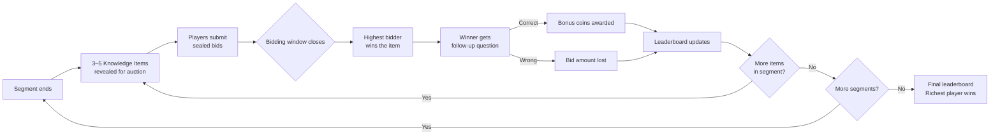

**Design decision baked in:** bidding is **sealed/blind**, not open-ascending. This is still the single most load-bearing rule in the whole game — it's what makes this test *self-knowledge* rather than *who has the most coins and the loudest mouse click*.

---

## 5. Product Pillars

| Pillar | What it means in practice |
|---|---|
| **Honest by design** | Sealed bidding, no visible bid amounts until reveal, no chat-shaming during bidding window |
| **Tension every round** | 10–15 second bid timers, animated countdown, coin-flip-style reveal moment |
| **Host-light** | A host can run this with zero setup — paste in items, hit start, the room does the rest |
| **Feels alive** | Every state transition has a Rive animation, not just a toast notification |
| **Replay-ready** | Session summary at the end: biggest overbid, best calibrated player, riskiest correct answer |
| **Generative, not static** | The item bank can write itself from session content, so the game never feels like homework to prep |
| **Legible chaos** | No matter how much is animating on screen, the player should always know exactly what state the round is in and what they need to do next |

---

## 6. Advanced Game Mechanics

This is where the game grows beyond the original three-step loop into something with real strategic depth. None of these are required for v1 — they're a menu the host can toggle per room.

### 6.1 Confidence Insurance
Before bidding, a player can spend a small flat fee (e.g. 10 coins) to **insure their bid** — if they lose the follow-up question, they get back 50% of their bid instead of 0%. This adds a genuine risk-management decision layer: do you bid aggressively and insure, or bid conservatively and go bare? It mirrors real financial decision-making in miniature, which is part of why it'll resonate with anyone who's ever hedged a bet.

### 6.2 Steal Tokens
Each player starts with one **Steal Token** per session. If you lose an auction by a narrow margin (configurable threshold, e.g. within 10% of the winning bid), you can spend your token to force a **shared follow-up** — both you and the winner answer the same question privately; whoever answers correctly (or more precisely, for numeric answers) takes the full pot. This punishes timid winning bids and rewards players who almost-but-didn't commit enough.

### 6.3 Streak Multipliers
Three correct follow-ups in a row activates a visible "hot streak" badge and a 1.25x multiplier on the next bonus payout. This is purely a momentum/morale mechanic — it makes a confident, well-calibrated player feel unstoppable for a stretch, which is good TV even if it's not strictly "fair."

### 6.4 Mystery Items
Occasionally, an item is revealed only as a **category** (e.g. "Something about today's architecture diagram") with the specific prompt hidden until after bids lock. This is a pure nerve-test — you're betting on your grasp of a topic, not a specific fact, which surfaces a different and arguably more valuable kind of knowledge: do you actually understand the material, or did you just memorize one slide?

### 6.5 Spectator Side-Bets
Non-playing spectators (see Section 22) can place small side-wagers on *who* will win a given auction, without affecting the real economy. This turns passive viewers into engaged ones and is a natural feature for larger sessions (all-hands, conference talks) where not everyone wants to play but everyone wants to watch.

### 6.6 The Wildcard Round
Once per session, the host can trigger a **Wildcard Round**: all bid caps are lifted, payout multipliers double, and the bidding window shrinks to 7 seconds. It's a designed chaos injection for when a session is dragging or one player has run away with the lead — a release valve, not a balance mechanic.

### 6.7 Team Pooling (optional mode)
Teams share a coin pool; one designated "Captain" per round places the bid on the team's behalf, but the whole team can see a private internal chat to negotiate the bid amount before the timer runs out. This is the version of the game built for classrooms and corporate offsites where individual scoring might feel too exposed.

---

## 7. System Architecture

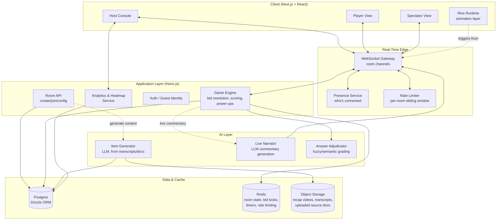

**What's new vs. the first draft:**

- **A Spectator client** with its own lighter WebSocket channel — spectators receive broadcast state but never bid, so they don't need the full player protocol surface.
- **A Rate Limiter sitting at the edge**, not buried in the app layer, so abusive reconnect loops or bid-spam get rejected before they ever reach the Game Engine.
- **An Analytics/Heatmap service** reading from Postgres independently of the live path — this can run slower, heavier queries without ever risking the latency of an active round.
- **A three-part AI layer** — generation (before the session), narration (during), and adjudication (grading free-text answers) — each with a distinct latency budget. Narration has to be fast (sub-second) and can be a smaller/cheaper model; generation can be slow and is run ahead of time; adjudication needs to be fast *and* accurate since it directly affects scoring.

---

## 8. Data Model

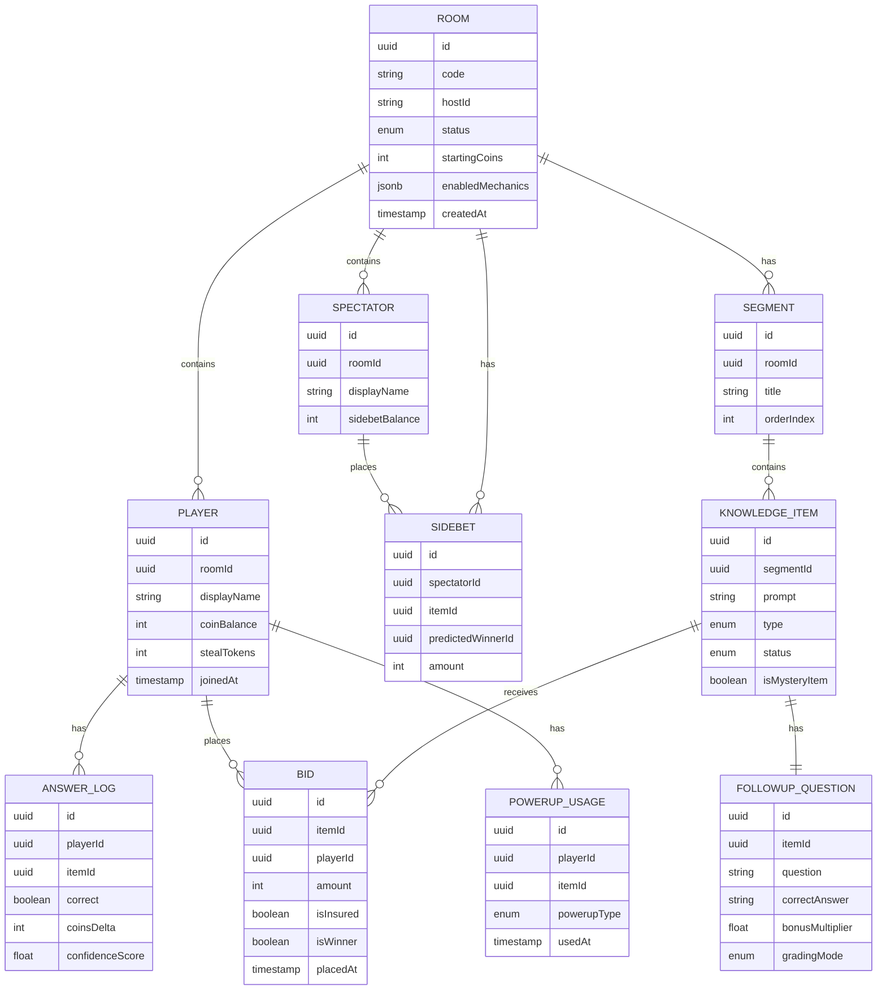

---

## 9. Game State Machine

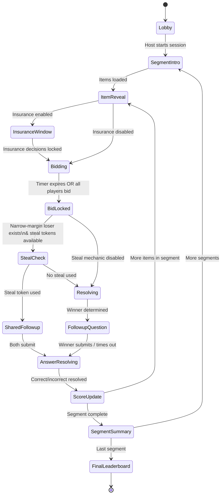

---

## 10. Real-Time Sequence: One Auction Round

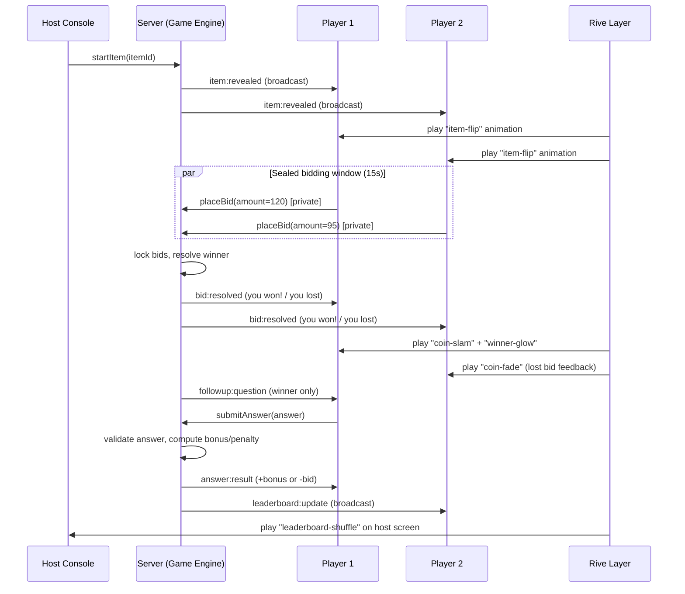

---

## 11. Real-Time Sequence: Power-Up Usage

A new diagram showing how the Steal Token mechanic (Section 6.2) plays out — this is the kind of interaction that makes the game feel like it has real depth rather than being a one-note loop.

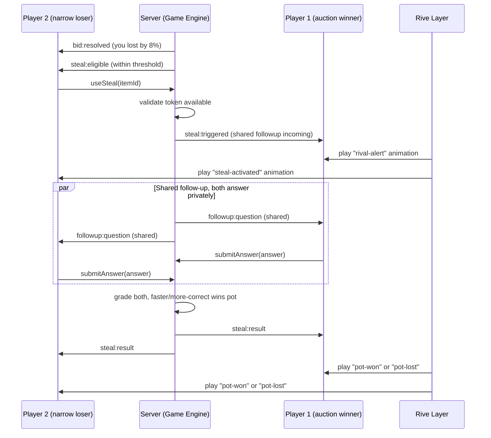

---

## 12. Room Lifecycle

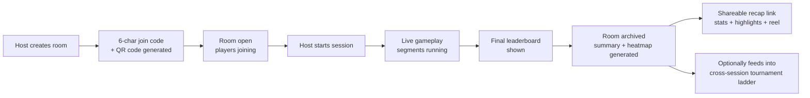

Rooms are **ephemeral by default** — auto-expire 24h after the session ends unless the host explicitly saves the item bank for reuse. This keeps the product feeling like a live event space, not a permanent dashboard. The one exception is the **heatmap and recap data**, which is durable by default since that's the artifact a host actually wants to keep.

---

## 13. UI/UX Design System

### 13.1 Visual Direction

| Element | Direction |
|---|---|
| **Mode** | Dark-first (designed to be projected/shared on a big screen), with a light-mode variant for personal devices |
| **Palette** | Deep charcoal/near-black base (`#0B0D12`), one electric accent (amber-gold `#F5B82E` for coins/currency), a cool secondary (`#5B8CFF`) for info states, a violet tertiary (`#A45BFF`) reserved for power-ups/mystery items so they read as a distinct "rare" tier, signal red/green reserved *only* for win/loss |
| **Typography** | A confident geometric sans for numbers/coins (e.g. Space Grotesk or Clash Display for headlines), a clean readable sans for body (Inter) — numbers get a tabular, monospaced treatment so coin counts don't jitter while animating |
| **Shape language** | Rounded-but-sharp — 12–16px corner radii, subtle bevel/glow on interactive elements, coin iconography used as a literal currency unit throughout |
| **Texture** | Soft grain/noise overlay on dark backgrounds to avoid flat-dead-black; glassmorphic panels for bid input on player view; a faint animated "auction floor" particle backdrop on the host big-screen view during bidding windows, subtle enough not to distract |
| **Theming/skins** | Room hosts can pick a **vibe pack** — e.g. "Wall Street," "Game Show," "Heist," "Arcane Market" — which swaps accent colors, iconography (coins become chips/gems/runes), and Rive idle animations without touching layout. This is a cheap way to make the same engine feel bespoke per audience (a corporate offsite vs. a classroom vs. a friend group want very different costumes on the same skeleton) |
| **Sound** | Layered audio cues: bid placed = soft click, reveal = rising whoosh, correct = bright chime, wrong = low thud, steal triggered = a sharp "alarm" stinger, wildcard round = a tonal shift in the ambient background track |

### 13.2 Motion Philosophy

Three motion tiers, escalating with stakes:

1. **Micro** (buttons, input feedback) — 100–150ms, eased, CSS/Framer Motion, no Rive needed.
2. **Moment** (item reveal, bid lock, coin transfer, power-up activation) — Rive-driven, 400–800ms, the "game feel" layer.
3. **Milestone** (round win, segment end, final leaderboard, wildcard round trigger) — full-screen Rive sequences, 1.5–3s, allowed to take over the screen briefly because the payoff has earned it.

**Added principle: motion should narrate, not just decorate.** A coin animation that visibly travels *from* the loser's balance counter *to* the winner's balance counter (rather than two independent counters updating separately) teaches the economy through motion alone — players should be able to mute the sound, ignore the text, and still understand who won what just by watching where the coins moved.

---

## 14. Screen-by-Screen Breakdown

```mermaid
flowchart TB
    subgraph HostFlow["Host Console"]
        H1[Create/Configure Room\nchoose mechanics + vibe pack] --> H2[Lobby — player avatars\njoining in real time]
        H2 --> H3[Big-Screen Game View\nitem reveal, timer, leaderboard]
        H3 --> H4[Round Control Bar\nstart bid / lock / reveal / next]
        H4 --> H5[Live Heatmap Sidebar\nconfidence distribution per item]
        H5 --> H6[Final Leaderboard + Recap + Heatmap Export]
    end

    subgraph PlayerFlow["Player View (mobile-first)"]
        P1[Join via code/QR] --> P2[Waiting Room\ncoin balance + avatar picker]
        P2 --> P3[Item Card\nread the knowledge item]
        P3 --> P3b{Insurance offered?}
        P3b -->|Yes| P3c[Insurance toggle]
        P3b -->|No| P4[Sealed Bid Slider\n+ confirm]
        P3c --> P4
        P4 --> P5[Result Card\nwon/lost + animation]
        P5 --> P5b{Eligible to steal?}
        P5b -->|Yes| P5c[Steal token prompt]
        P5b -->|No| P6[Follow-up Question\nif winner]
        P5c --> P6
        P6 --> P7[Outcome Card\nbonus/penalty]
        P7 --> P2
    end

    subgraph SpectatorFlow["Spectator View"]
        S1[Join as spectator] --> S2[Watch live state\n+ side-bet panel]
        S2 --> S3[Side-bet result feedback]
        S3 --> S2
    end
```

**Player view design notes:**
- The **bid input is a slider + numeric stepper combo** — sliders make the "how confident am I" decision feel visceral, while the stepper allows precision.
- A **running "confidence meter"** next to the bid slider fills with color as the bid rises.
- The **coin balance is always visible, pinned top of screen**, and ticks up/down with an animated counter.
- A **subtle pulse on the avatar of the current high-confidence bidder pool** — without revealing amounts — so players sense urgency without anyone leaking actual numbers.

**Host view design notes:**
- The **leaderboard sits permanently visible** on the big screen with subtle live re-ranking animations.
- **Round control bar** is deliberately minimal — Start Bid / Lock Bids / Reveal / Next Item.
- A **Live Heatmap Sidebar** (detailed in Section 15) gives the host a private, real-time read on collective confidence per item, invisible to players.

---

## 15. The Knowledge Heatmap (Host Superpower)

This is one of the most valuable additions worth elaborating on, because it's the feature that turns this from "a fun game" into "a tool a workshop facilitator or manager would actually pay for."

After each item resolves, the host console privately renders:

- **Bid distribution** — a small histogram of what everyone bid, anonymized, showing whether confidence was tightly clustered (everyone roughly agreed on their certainty) or wildly spread (some people were sure, others had no idea).
- **Calibration accuracy** — cross-referencing bid size against correctness, aggregated across the room: were high bidders generally right, or was the room systematically overconfident on this topic?
- **A running "knowledge gap index"** per segment — which topics produced the most overbidding-then-losing, which is a much sharper signal than a simple "% correct" because it captures *false confidence*, the more dangerous failure mode in real learning and real work.

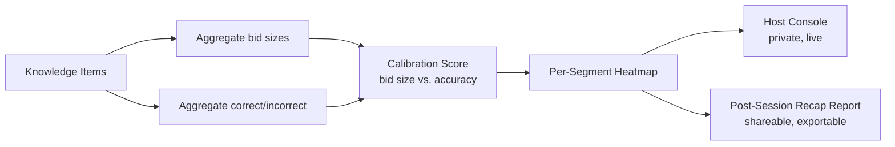

For a corporate onboarding session or a classroom, this single feature is arguably more valuable to the *host* than the entertainment value is to the *players* — it's a built-in, zero-extra-effort knowledge assessment that nobody experienced as a test.

---

## 16. AI Layer — Generation, Narration, Adjudication

### 16.1 Item & Question Generation
A host can paste in a transcript, upload a slide deck/PDF, or point at a prior session's notes, and the system generates a candidate bank of knowledge items + follow-up questions, each tagged with an estimated difficulty. The host reviews and can edit/discard before the bank goes live — generation should always be a draft, never a black box that ships unreviewed content into a live room.

### 16.2 Live Narrator
A lightweight, fast model generates short, game-show-style commentary lines reacting to live events — "Bold bid from the back row," "That's the third overbid this segment," "We have a steal in play" — rendered as captions on the host big screen. This is the feature that does the most to make the room feel like an *event* rather than a quiz, for almost no added gameplay complexity. It needs to be fast (sub-second) and should be allowed to be wrong/skip rather than block the game if latency spikes.

### 16.3 Answer Adjudication
For free-text follow-up answers (rather than multiple choice), a fast semantic-matching model decides whether an answer is "close enough" to the correct one, with a confidence score. Below a confidence threshold, the system flags the answer for the **host to manually adjudicate live** — this human-in-the-loop fallback matters a lot, because nothing kills trust in the game faster than an obviously-correct answer getting marked wrong by an overly literal string match.

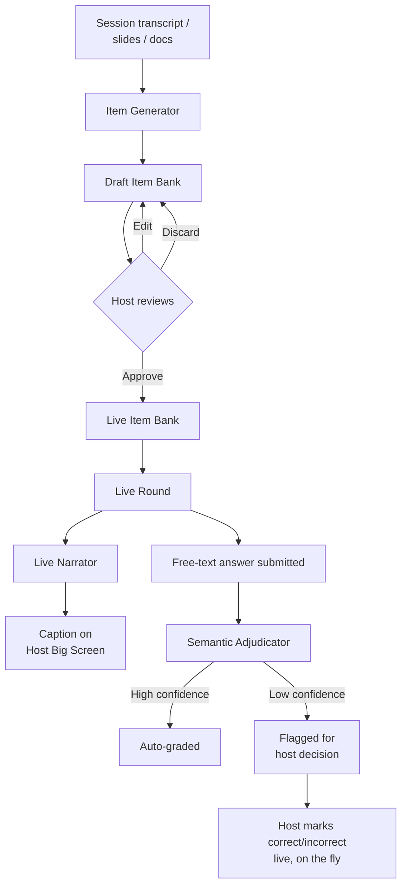

---

## 17. Rive Animation Strategy

| Animation asset | Rive State Machine inputs | Trigger |
|---|---|---|
| `item-flip` | `revealed (bool)`, `isMystery (bool)` | Item enters bidding phase |
| `coin-counter` | `targetValue (number)`, `delta (number)` | Any coin balance change — tweened count-up/down with a directional travel effect |
| `bid-slam` | `bidAmount (number)`, `isWinner (bool)` | Bid resolution broadcast |
| `confidence-meter` | `confidence (0–1 float)` | Live while dragging the bid slider |
| `correct-burst` / `wrong-shatter` | `outcome (enum)` | Follow-up answer resolved |
| `insurance-shield` | `active (bool)` | Insurance toggled on/off |
| `steal-activated` / `rival-alert` | `triggered (bool)` | Steal token used |
| `streak-flame` | `streakCount (number)` | Consecutive correct answers |
| `wildcard-burst` | `active (bool)` | Wildcard round begins |
| `leaderboard-shuffle` | `rankDelta (number)` per player | Leaderboard update event |
| `final-podium` | `placement (1/2/3)` | Final leaderboard screen |
| `vibe-pack-idle` | `theme (enum)` | Ambient background loop, swapped per room theme |

**Integration pattern:** keep Rive files as pure visual/animation logic with exposed inputs — the React layer only ever sets state machine inputs based on WebSocket events, never hardcodes timing. This means designers can iterate on `.riv` files independently of engineering touching game logic.

---

## 18. Tech Stack

| Layer | Recommendation | Why |
|---|---|---|
| Frontend framework | **Next.js 15 (App Router)** | Server components for room/session pages, client components for the live game surface |
| Real-time transport | **WebSockets via a dedicated gateway** (Socket.io, or Ably/Pusher if you want managed infra) | Sub-150ms round trip needed for bid timers to feel fair |
| Backend API | **Hono.js** | Lightweight, edge-friendly, fits your existing stack |
| Game state (ephemeral) | **Redis** | Round state, active bids, timers, presence — fast and disposable |
| Persistent data | **Postgres + Drizzle ORM** | Players, room history, item banks, final scores, heatmap data |
| Object storage | **S3-compatible storage** (R2/S3) | Recap videos, uploaded slide decks/transcripts feeding item generation |
| Animation | **Rive (web runtime)** | State-machine-driven, runtime-reactive animation |
| Styling | **Tailwind CSS + CSS variables for theming** | Fast iteration, supports dark/light + vibe-pack theming cleanly |
| Micro-interactions | **Framer Motion** (layered under Rive for moment/milestone tier) | Layout transitions, list reordering, page transitions |
| Auth | **Guest identity** (name + avatar, no signup to join) + account system for hosts | Lowers friction for players joining a live room |
| AI — generation | **LLM with long-context document ingestion** | Reads transcripts/slides, drafts item bank |
| AI — narration | **Small/fast LLM, low-latency endpoint** | Live commentary captions |
| AI — adjudication | **Semantic similarity model or LLM with structured grading prompt** | Free-text answer grading with confidence score |
| Deployment | **Vercel (frontend) + a long-lived Node/Bun process or Fly.io/Render for the WebSocket gateway** | Next.js serverless functions aren't ideal for persistent WebSocket connections |

---

## 19. Real-Time Infrastructure Strategy

1. **Server-authoritative timers.** The server emits a `bidWindowEndsAt` timestamp; clients only render a countdown *to* it. Avoids drift, prevents unfair extensions.
2. **Optimistic UI, pessimistic resolution.** UI shows "bid placed ✓" immediately; actual win/loss only resolves once the server broadcasts it.
3. **Reconnection handling.** On reconnect, request a `room:snapshot` rather than replaying the full event log.
4. **Rate limiting per room.** Redis-backed sliding window limits scoped to `roomId`.
5. **Room codes over URLs as the primary join mechanic.** Short, human-readable codes plus QR fallback.
6. **Narrator latency isolation.** The AI Narrator runs on a separate, non-blocking channel — if it's slow or down, the round must continue without it. Cosmetic features should never be allowed to stall gameplay.
7. **Graceful degradation for free-text grading.** If the Adjudicator service is unavailable, fall back to exact/fuzzy string match and flag everything borderline for host review rather than failing the round.

---

## 20. Anti-Cheat & Integrity

A few integrity risks are specific to this game's mechanics and worth designing against deliberately:

- **Collusion in physical rooms.** Since this is often played in a shared physical space, players could verbally coordinate bids ("I'll go low so you can win it cheap"). Mitigation: the bid amount itself isn't the exploit surface — what matters is the follow-up question still has to be answered correctly, so collusion only helps you *win* an item, not *keep* the coins. This is actually a nice emergent property of the design rather than something that needs a heavy-handed fix.
- **Multi-accounting.** A player joining with two devices to get two attempts. Mitigation: bind one active player session per device fingerprint/IP-cluster per room, and let the host see a "possible duplicate" flag rather than silently blocking (false positives on shared wifi are common, so don't auto-kick).
- **Network manipulation / client tampering.** Since all resolution is server-authoritative (Section 19), a malicious client can't fake a win — at worst it can refuse to render correctly, which only hurts the cheater's own experience.
- **AI adjudication gaming.** A player might try to write a deliberately vague free-text answer designed to exploit semantic-similarity leniency. Mitigation: adjudication confidence below a threshold always routes to host review rather than auto-passing borderline answers.

---

## 21. Accessibility & Inclusivity

Worth being explicit about this rather than treating it as an afterthought, since a lot of "creative UI" games quietly become unusable for some players:

- **Color is never the only signal.** Win/loss/power-up states always pair color with shape/icon/motion direction, for colorblind players.
- **Reduced-motion mode.** A toggle that swaps Rive milestone animations for instant, simple state changes — important for vestibular sensitivity and for low-end devices.
- **Captions for the AI Narrator** are the *default* delivery, not optional — this is a feature that's accessible by construction rather than needing a separate audio-description pass.
- **Timer flexibility.** Hosts can extend bid windows for sessions including English-language learners, younger players, or accessibility accommodations, without it feeling like a visible "special mode" — it's just a room setting.
- **Keyboard and switch-access support** for the bid slider/stepper, not just touch/mouse.

---

## 22. Progression, Identity & Cross-Session Meta

Once a single room works well, the natural next layer is making the *player*, not just the room, persistent:

- **Lightweight player profiles** (optional account, not required to play) that track lifetime calibration score — a number that says "across every game you've played, how well does your bid size predict whether you're actually right?" This is genuinely interesting personal data that no competitor surfaces.
- **Cross-session tournament ladders** for recurring groups (a company that plays weekly, a class that plays every unit) — seasons, rankings, and a persistent "Best Calibrated Player" title.
- **Achievement badges** tied to mechanics, not just winning: "Insured and still lost" (badge of honor for the brave), "Perfect Steal," "Survived a Wildcard Round in the lead."
- **Spectator-to-player conversion path** — someone who watched and side-bet in one session is one tap away from joining as a real player next time, which is a clean, low-friction growth loop.

---

## 23. Monetization Angle (Optional)

If this becomes a standalone product rather than an internal tool, a sensible freemium shape:

| Tier | What's included |
|---|---|
| **Free** | Unlimited rooms, core loop, default vibe pack, up to N players per room |
| **Pro (host subscription)** | AI item generation from documents, full heatmap/recap exports, all vibe packs, higher player caps, advanced mechanics (steal tokens, insurance, wildcard rounds) |
| **Org/Team** | Cross-session tournaments, persistent player profiles across a workspace, SSO, analytics dashboard for L&D/training teams |

The honest pitch to a paying customer (an L&D team, a conference organizer, a teacher) isn't "a fun game" — it's "a live engagement tool that also hands you an honest map of what your audience actually absorbed," which is a budget line that already exists in most training and event orgs.

---

## 24. Implementation Roadmap

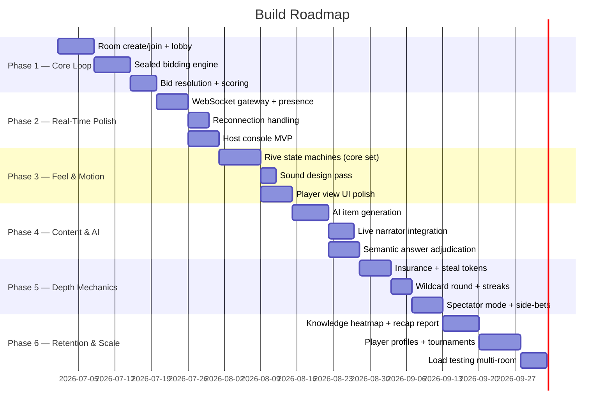

**Build order rationale:** get the *honest, server-authoritative bidding loop* rock solid first — the game's credibility depends entirely on bid resolution being fair and tamper-proof. Then layer motion (which makes people fall in love with it), then AI content generation (which removes the prep burden that kills most quiz tools after one or two uses), then the deeper strategic mechanics (which give it replay depth), then the retention layer (which turns one fun session into a recurring habit).

---

## 25. Anti-Snowball & Balance Mechanics

- **Bid cap per round:** max bid = a configurable percentage of current balance (e.g. 40%), so a broke player is never fully locked out.
- **Proportional bonus payout:** correct answers pay out as a multiplier on the bid (e.g. 1.5–2x), preserving the risk/reward curve at every wealth level.
- **Comeback segment:** host can flag one segment as "double stakes" to keep a late lead from feeling unbeatable.
- **Final round wager:** last item allows an all-or-nothing optional side wager, independent of the normal bid, for end-game drama.
- **Insurance and steal tokens (Section 6)** double as soft balance levers — a struggling player who plays insured/defensively can stay solvent; a player who lost an auction narrowly always has a comeback lever via steal.

---

## 26. Risks & Mitigations

| Risk | Mitigation |
|---|---|
| Game feels punishing rather than fun if losses sting too much | Tune payout curves so a single bad bid is recoverable; lean on insurance/comeback mechanics; keep loss animations punchy but not mocking in tone |
| AI-generated items are low quality or factually wrong | Always require host review/approval before items go live; never auto-publish generated content |
| Sealed bidding feels slow/awkward for large rooms (50+ players) | Cap default room size for the core competitive mode; route larger audiences toward spectator + side-bet mode instead |
| Motion/audio becomes distracting rather than delightful | Reduced-motion and reduced-audio settings as first-class room options, not hidden accessibility toggles |
| Free-text grading disputes erode trust | Host-adjudication fallback always available live, visible to the room so disputes get resolved transparently rather than silently |
| Feature creep (Sections 6, 22, 23) overwhelms a simple core loop | Every advanced mechanic is opt-in per room; a brand-new host's default room should look exactly like the Section 4 loop with nothing extra turned on |

---

## 27. North Star Metrics

- **Calibration delta** — the gap between average bid confidence and actual accuracy, trending toward zero across repeat plays for the same group (this is literally the product's reason for existing).
- **Session completion rate** — % of started rooms that reach a final leaderboard, a proxy for whether the pacing/timers are working.
- **Host-initiated reuse rate** — % of hosts who run a second session within 30 days, the clearest signal that this earns a place in someone's recurring toolkit rather than being a one-time novelty.
- **Spectator-to-player conversion rate** — validates the growth loop described in Section 22.

---

## 28. My Honest Take

A few things I'd push back on or flag if I were sitting across the table from you on this:

- **The biggest danger isn't the tech, it's scope.** Sections 6, 16, and 22 alone could each be a full product. The single highest-leverage thing you can do is ship the Section 4 loop with genuinely great motion and nothing else, get five real rooms played by real people, and only then decide which advanced mechanic earns its place — not because any of them are bad ideas, but because a sealed-bid auction with great game-feel is already a complete, shippable, delightful product on its own.
- **The Knowledge Heatmap (Section 15) is the feature I'd actually lead with in a pitch**, even though it's listed two-thirds of the way through this document. "Fun party game" is a crowded, low-trust pitch to a workshop facilitator or manager with a budget. "A live engagement format that also tells you exactly what your room didn't absorb" is a pitch with a budget line behind it. If you're building this for distribution rather than just for fun, lead with that, not with the game-show framing.
- **Sealed bidding is the right call, but test it ruthlessly with real groups before committing.** It's correct in theory, but some groups genuinely enjoy the theater of open, trash-talking bidding more than the cleaner honesty of sealed bids. Consider making bid visibility itself a room setting — sealed for serious/educational contexts, open for party contexts — rather than assuming one mode wins everywhere.
- **The AI Narrator is a delight multiplier, but it's also the easiest thing to cut if you're behind schedule** — the game is completely intact without it. Build it last, and build it so it can fail silently.
- **Don't let the vibe-pack theming system become a content production burden.** If "Wall Street," "Heist," "Arcane Market" each need bespoke Rive assets, that's real ongoing design cost. Build one excellent default skin first; only invest in additional vibe packs once you've validated people actually want to reskin the game, not just play it.

If it were me building this, the very first thing I'd want to feel — before any AI layer, before any power-up — is the **15-second sealed-bid window with a real countdown, a real reveal, and one good coin-slam animation**. If that fifteen seconds feels electric with three friends testing it on their phones, everything else in this document is worth building. If it doesn't, no amount of Rive polish or AI narration will save it — so that's the thing to prototype first, this week, before touching the architecture diagrams above.

Want me to turn the very first phase of the roadmap — room creation, lobby, and the sealed-bid round — into an actual working Next.js + WebSocket prototype next?