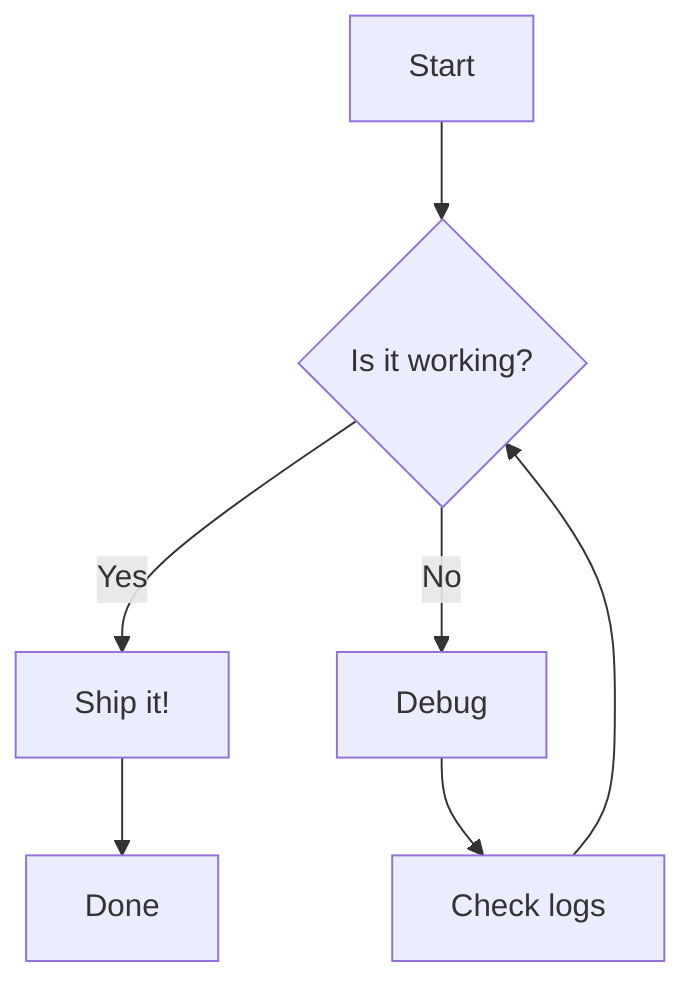
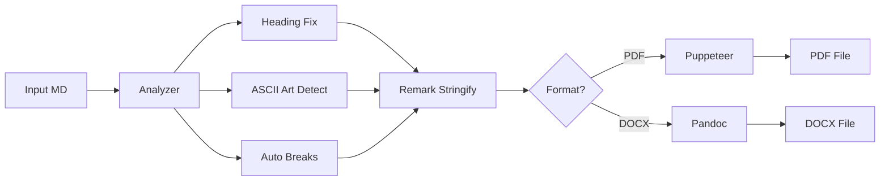
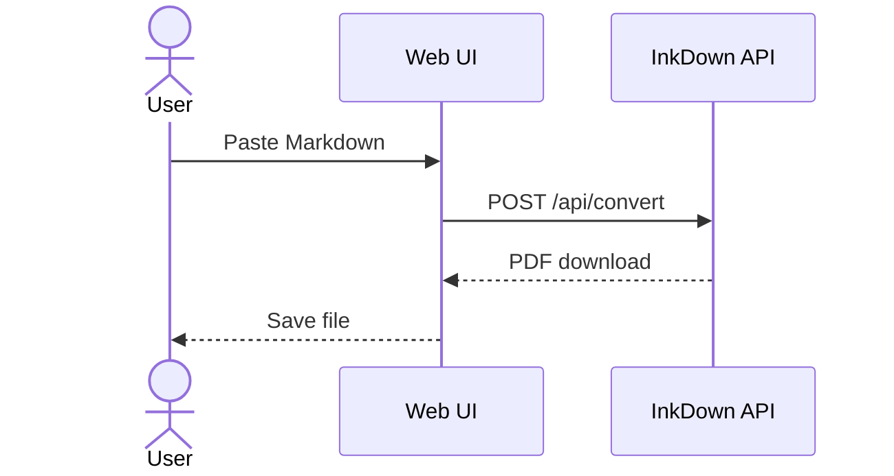
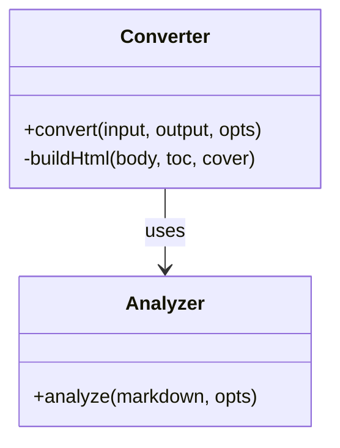
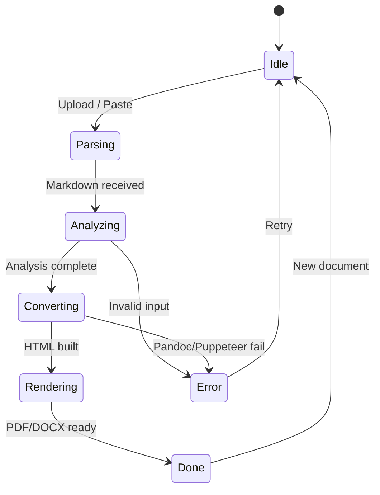
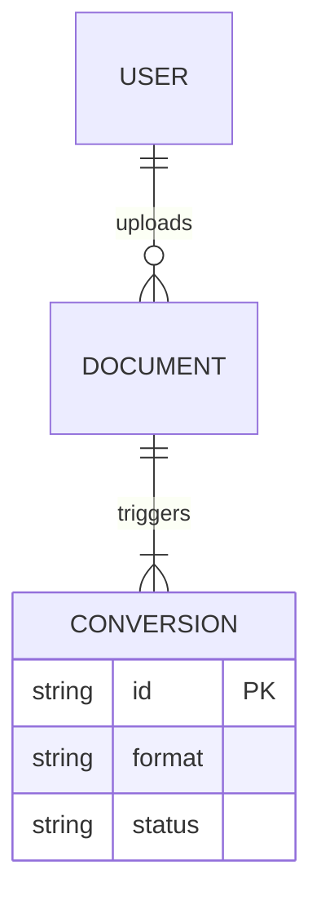
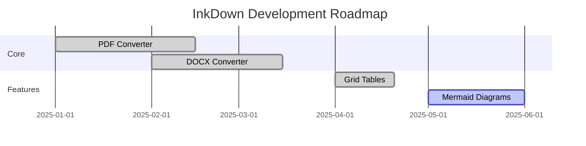
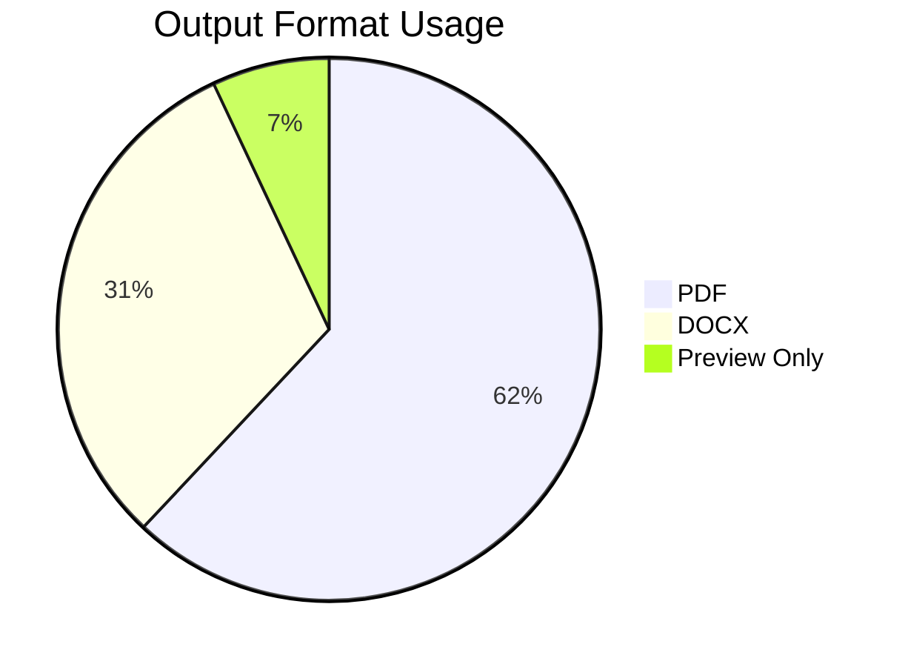
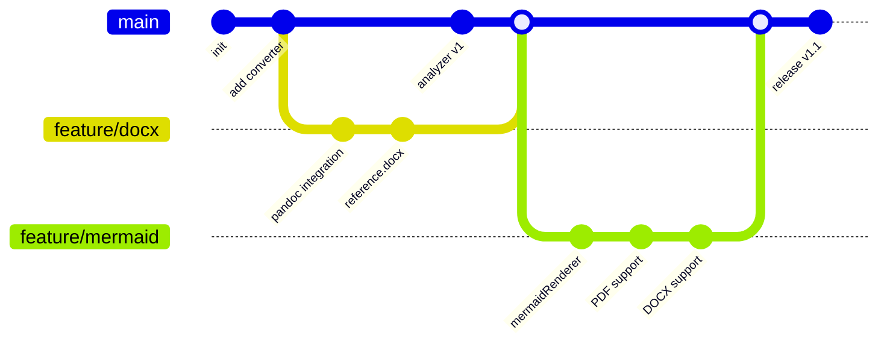
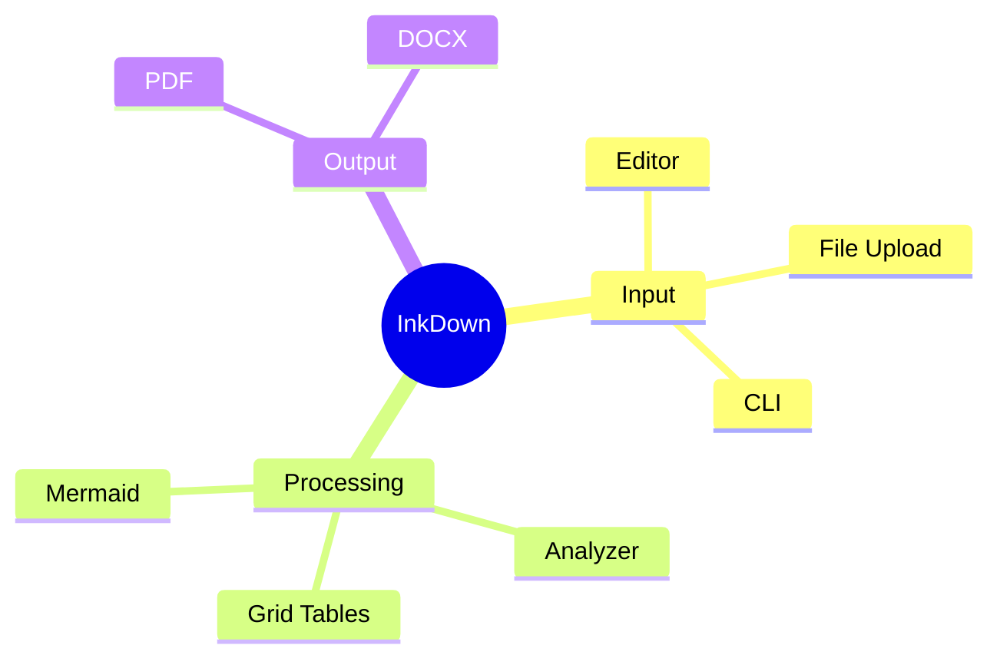

# InkDown Master Test Document

This document exercises **every** rendering feature for visual QA.

---

## 1. Inline Formatting

This is **bold**, *italic*, ***bold-italic***, ~~strikethrough~~, and `inline code`.

Here is a [hyperlink](https://example.com) and an auto-link: https://example.com.

Superscript: H~2~O and E=mc^2^ (if supported).

---

## 2. Headings

### Third Level
#### Fourth Level
##### Fifth Level
###### Sixth Level

---

## 3. Blockquotes

> Single-level blockquote with **bold** inside.

> **Nested blockquotes:**
>
> > Second level
> >
> > > Third level — still readable?

> **Quote with other elements:**
>
> - Bullet inside a quote
> - Another bullet
>
> ```js
> console.log("code inside a quote");
> ```

---

## 4. Lists

### Unordered

- Item one
- Item two
  - Nested A
  - Nested B
    - Deep nested
- Item three

### Ordered

1. First
2. Second
   1. Sub-first
   2. Sub-second
3. Third

### Task List

- [x] Completed task
- [ ] Incomplete task
- [x] Another done
- [ ] Still pending

### Definition-style (if supported)

Term 1
: Definition of term 1

Term 2
: Definition of term 2

---

## 5. Code Blocks

### JavaScript

```js
function greet(name) {
  const msg = `Hello, ${name}!`;
  console.log(msg);
  return msg;
}

// Arrow function
const add = (a, b) => a + b;
```

### Python

```python
from pathlib import Path

def convert(src: Path, dst: Path) -> None:
    """Convert markdown to PDF."""
    content = src.read_text(encoding="utf-8")
    # process...
    dst.write_bytes(result)
```

### Bash

```bash
#!/usr/bin/env bash
set -euo pipefail

for f in *.md; do
  echo "Converting $f …"
  inkdown convert "$f" --format pdf
done
```

### JSON

```json
{
  "name": "inkdown",
  "version": "1.1.0",
  "scripts": {
    "dev": "node server.js",
    "test": "node scripts/test-16.js"
  }
}
```

### Plain / no language

```
This is a fenced code block
with no language specified.
    Indentation preserved.
```

### Indented code block (4 spaces)

    This is an indented code block.
    It should render as code as well.

---

## 6. Tables

### Simple Table

| Feature       | PDF | DOCX |
|---------------|-----|------|
| Headings      | ✅  | ✅   |
| Tables        | ✅  | ✅   |
| Mermaid       | ✅  | ✅   |
| Grid Tables   | ✅  | ✅   |
| Cover Page    | ✅  | ❌   |

### Aligned Columns

| Left         | Center       | Right        |
|:-------------|:------------:|-------------:|
| left-aligned | centered     | right-aligned|
| data         | data         | 1,234.56     |
| more         | more         | 99.9         |

### Wide Table

| Col 1 | Col 2 | Col 3 | Col 4 | Col 5 | Col 6 | Col 7 | Col 8 |
|-------|-------|-------|-------|-------|-------|-------|-------|
| A1    | B1    | C1    | D1    | E1    | F1    | G1    | H1    |
| A2    | B2    | C2    | D2    | E2    | F2    | G2    | H2    |

### Table with Inline Formatting

| Name       | Description                          |
|------------|--------------------------------------|
| **Bold**   | This cell has `code` and *italics*   |
| ~~Strike~~ | [Link](https://example.com) in cell  |

---

## 7. Horizontal Rules

Above the rule.

---

***

___

Below the rules.

---

## 8. Images


---

## 9. HTML (raw)

<details>
<summary>Click to expand</summary>

This is inside a `<details>` block.

- Works in browsers
- May not render in PDF

</details>

<div style="background:#f0f0f0; padding:10px; border-radius:6px;">
  <strong>Styled HTML box</strong> — does this render?
</div>

---

## 10. Footnotes (if supported)

Here is a sentence with a footnote.[^1]

And another.[^note]

[^1]: This is the first footnote.
[^note]: This is a named footnote with **bold** text.

---

## 11. Math (KaTeX / LaTeX)

Inline math: $E = mc^2$

Block math:

$$
\int_{0}^{\infty} e^{-x^2} \, dx = \frac{\sqrt{\pi}}{2}
$$

$$
\sum_{n=1}^{\infty} \frac{1}{n^2} = \frac{\pi^2}{6}
$$

---

## 12. Mermaid Diagrams

### 12.1 Flowchart (TD)



### 12.2 Flowchart (LR)



### 12.3 Sequence Diagram



### 12.4 Class Diagram



### 12.5 State Diagram



### 12.6 ER Diagram



### 12.7 Gantt Chart



### 12.8 Pie Chart



### 12.9 Git Graph



### 12.10 Mindmap



---

## 13. Nested / Mixed Content

> ### Quote with a Table
>
> | A | B |
> |---|---|
> | 1 | 2 |
>
> And a code block:
>
> ```python
> print("inside a quote")
> ```

### List with Code and Tables

1. First, run the install:

   ```bash
   npm install
   ```

2. Then check the config:

   | Key      | Value       |
   |----------|-------------|
   | format   | pdf         |
   | toc      | true        |

3. Finally convert:

   ```bash
   node server.js
   ```

---

## 14. Long Paragraph (Wrapping Test)

Lorem ipsum dolor sit amet, consectetur adipiscing elit. Sed do eiusmod tempor incididunt ut labore et dolore magna aliqua. Ut enim ad minim veniam, quis nostrud exercitation ullamco laboris nisi ut aliquip ex ea commodo consequat. Duis aute irure dolor in reprehenderit in voluptate velit esse cillum dolore eu fugiat nulla pariatur. Excepteur sint occaecat cupidatat non proident, sunt in culpa qui officia deserunt mollit anim id est laborum. Cras justo odio, dapibus ac facilisis in, egestas eget quam. Donec id elit non mi porta gravida at eget metus. Nullam quis risus eget urna mollis ornare vel eu leo.

---

## 15. Special Characters & Emoji

Arrows: → ← ↑ ↓ ↔ ⇒ ⇐  
Symbols: © ® ™ § ¶ † ‡ • ° ± ÷ × ≈ ≠ ≤ ≥  
Emoji: 🚀 📄 ✅ ❌ ⚡ 🎨 🔧 📦  
Quotes: "curly doubles" 'curly singles' «guillemets»  
Dashes: en–dash em—dash  

---

## 16. Page Break Handling

Content before the break.

<div style="page-break-after: always;"></div>

Content after the break — this should start on a new page in PDF.

---

*End of master test document.*
